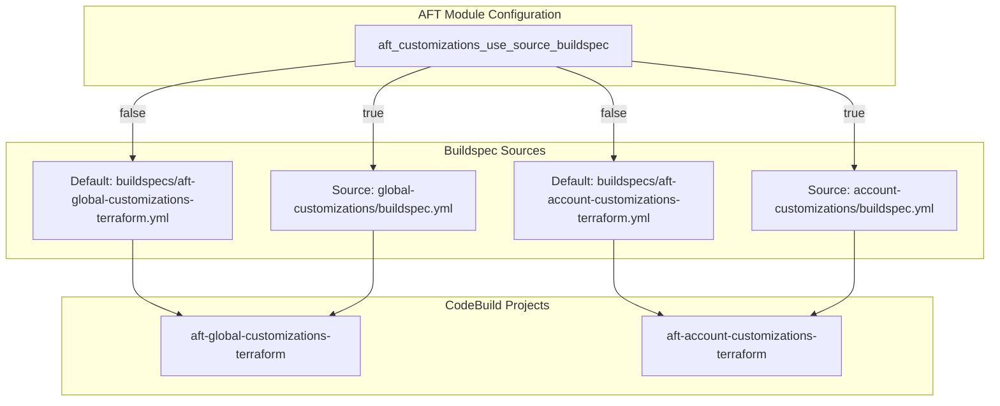
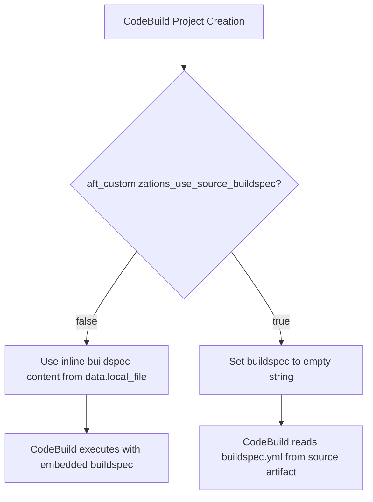

# Design Document: Custom Buildspec Support for AFT Customizations

## Overview

This design enables AFT users to provide custom buildspec files in their customization repositories instead of using the hardcoded AFT defaults. The implementation uses Terraform's conditional expressions to switch between inline buildspec content and source artifact buildspec based on a boolean variable.

When enabled, CodeBuild projects will read `buildspec.yml` from the source artifact (the customization repository) rather than using the embedded buildspec content from AFT's module files.

## Architecture



### Decision Flow



## Components and Interfaces

### 1. Root Module Variable

**File:** `variables.tf`

```hcl
variable "aft_customizations_use_source_buildspec" {
  description = "When true, CodeBuild projects for global and account customizations will use buildspec.yml from the source repository instead of AFT defaults. Users must provide buildspec.yml in their customization repositories."
  type        = bool
  default     = false
  validation {
    condition     = contains([true, false], var.aft_customizations_use_source_buildspec)
    error_message = "Valid values for var: aft_customizations_use_source_buildspec are (true, false)."
  }
}
```

### 2. Module Variable Passthrough

**File:** `main.tf` (aft-customizations module call)

The variable must be passed from the root module to the aft-customizations submodule:

```hcl
module "aft_customizations" {
  source = "./modules/aft-customizations"
  # ... existing variables ...
  aft_customizations_use_source_buildspec = var.aft_customizations_use_source_buildspec
}
```

### 3. Submodule Variable Definition

**File:** `modules/aft-customizations/variables.tf`

```hcl
variable "aft_customizations_use_source_buildspec" {
  description = "When true, use buildspec from source repository instead of AFT defaults"
  type        = bool
  default     = false
}
```

### 4. CodeBuild Project Modifications

**File:** `modules/aft-customizations/codebuild.tf`

The `source` block in each CodeBuild project will use a conditional expression:

```hcl
# For aft-global-customizations-terraform
source {
  type      = "CODEPIPELINE"
  buildspec = var.aft_customizations_use_source_buildspec ? "" : data.local_file.aft_global_customizations_terraform.content
}

# For aft-account-customizations-terraform
source {
  type      = "CODEPIPELINE"
  buildspec = var.aft_customizations_use_source_buildspec ? "" : data.local_file.aft_account_customizations_terraform.content
}
```

### 5. Example Buildspec Files

**Files:** 
- `sources/aft-customizations-repos/aft-global-customizations/buildspec.yml.example`
- `sources/aft-customizations-repos/aft-account-customizations/buildspec.yml.example`

These example files will be copies of the default buildspecs that users can reference when creating their own.

## Data Models

### Variable Configuration

| Variable | Type | Default | Description |
|----------|------|---------|-------------|
| `aft_customizations_use_source_buildspec` | bool | false | Controls buildspec source for customization CodeBuild projects |

### CodeBuild Source Configuration States

| State | buildspec value | Behavior |
|-------|-----------------|----------|
| Default (false) | `data.local_file.*.content` | Uses embedded buildspec from AFT module |
| Source (true) | `""` (empty string) | Reads buildspec.yml from source artifact |

### Affected Resources

| Resource | Type | Modification |
|----------|------|--------------|
| `aws_codebuild_project.aft_global_customizations_terraform` | CodeBuild Project | Conditional buildspec in source block |
| `aws_codebuild_project.aft_account_customizations_terraform` | CodeBuild Project | Conditional buildspec in source block |


## Correctness Properties

*A property is a characteristic or behavior that should hold true across all valid executions of a system—essentially, a formal statement about what the system should do. Properties serve as the bridge between human-readable specifications and machine-verifiable correctness guarantees.*

Based on the prework analysis, the following properties can be verified:

### Property 1: Default Buildspec Behavior

*For any* Terraform configuration where `aft_customizations_use_source_buildspec` is `false` (or not set), both `aft-global-customizations-terraform` and `aft-account-customizations-terraform` CodeBuild projects SHALL have their buildspec attribute set to the content of their respective default buildspec files.

**Validates: Requirements 2.1, 3.1, 4.1**

### Property 2: Source Buildspec Behavior

*For any* Terraform configuration where `aft_customizations_use_source_buildspec` is `true`, both `aft-global-customizations-terraform` and `aft-account-customizations-terraform` CodeBuild projects SHALL have their buildspec attribute set to an empty string.

**Validates: Requirements 2.2, 3.2**

## Error Handling

### Configuration Errors

| Error Scenario | Handling |
|----------------|----------|
| Invalid variable type | Terraform validation prevents non-boolean values |
| Missing buildspec.yml in source repo (when enabled) | CodeBuild fails at runtime with clear error message |
| Malformed buildspec.yml | CodeBuild fails at runtime with YAML parsing error |

### Runtime Considerations

When `aft_customizations_use_source_buildspec` is `true`:
- Users must ensure `buildspec.yml` exists in the root of their customization repositories
- The buildspec must follow AWS CodeBuild buildspec syntax
- Missing or invalid buildspec files will cause CodeBuild execution failures (not Terraform failures)

### Rollback Strategy

If custom buildspecs cause issues:
1. Set `aft_customizations_use_source_buildspec = false`
2. Run `terraform apply` to revert to AFT default buildspecs
3. CodeBuild projects will immediately use embedded buildspecs on next execution

## Testing Strategy

### Unit Tests (Terraform Validation)

1. **Variable Definition Tests**
   - Verify variable exists in root `variables.tf`
   - Verify variable has correct type (bool)
   - Verify variable has default value of `false`
   - Verify variable is passed to aft-customizations module

2. **File Existence Tests**
   - Verify example buildspec files exist in template directories
   - Verify default buildspec files remain in buildspecs directory

### Property-Based Tests (Terraform Plan Validation)

Property tests should use `terraform plan` with different variable configurations to verify the conditional logic:

**Property Test Configuration:**
- Use `terraform plan -out=plan.tfplan` to generate plans
- Use `terraform show -json plan.tfplan` to extract resource configurations
- Parse JSON to verify buildspec values

**Test Framework:** Terratest (Go) or pytest with python-terraform

**Property 1 Test: Default Buildspec Behavior**
```
Feature: custom-buildspec-support, Property 1: Default Buildspec Behavior
For all Terraform plans where aft_customizations_use_source_buildspec is false:
  - aft-global-customizations-terraform.source.buildspec == file content
  - aft-account-customizations-terraform.source.buildspec == file content
```

**Property 2 Test: Source Buildspec Behavior**
```
Feature: custom-buildspec-support, Property 2: Source Buildspec Behavior
For all Terraform plans where aft_customizations_use_source_buildspec is true:
  - aft-global-customizations-terraform.source.buildspec == ""
  - aft-account-customizations-terraform.source.buildspec == ""
```

### Integration Tests

1. **Terraform Validate**
   - Run `terraform validate` to ensure configuration is syntactically correct

2. **Terraform Plan**
   - Generate plans with both variable states
   - Verify no unexpected resource changes

### Test Execution

```bash
# Validate Terraform configuration
terraform validate

# Test default behavior (variable not set or false)
terraform plan -var="aft_customizations_use_source_buildspec=false" -out=default.tfplan
terraform show -json default.tfplan | jq '.resource_changes[] | select(.address | contains("codebuild"))'

# Test source buildspec behavior
terraform plan -var="aft_customizations_use_source_buildspec=true" -out=source.tfplan
terraform show -json source.tfplan | jq '.resource_changes[] | select(.address | contains("codebuild"))'
```
